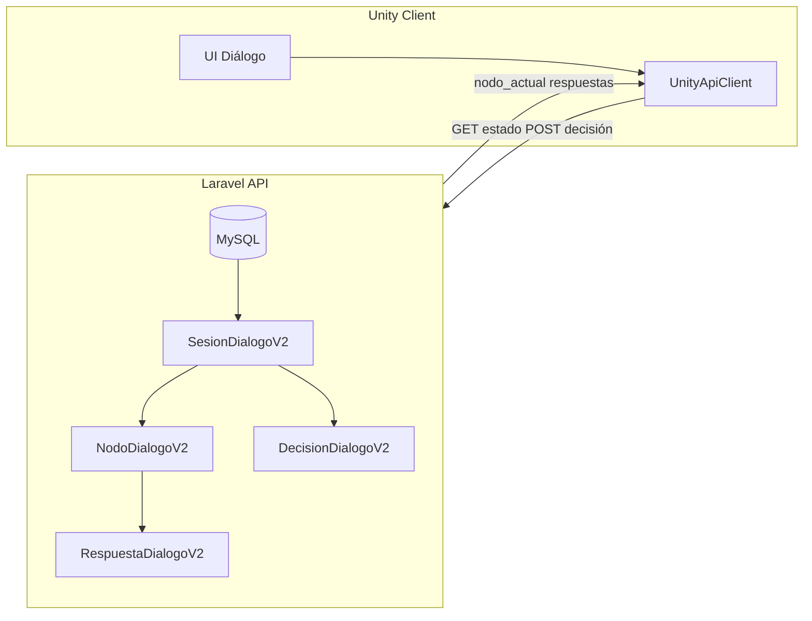

# Cómo funciona el sistema de diálogos Laravel / Unity

Descripción del flujo del sistema de diálogos entre Laravel (origen de verdad: nodos, respuestas, decisiones) y Unity (cliente que muestra el diálogo y envía decisiones), usando el API existente y el cliente C# implementado.

---

## Visión general

Laravel es la **fuente de verdad**: almacena diálogos (grafos de nodos y respuestas), sesiones de juicio, asignación de roles y el estado en tiempo real del diálogo (nodo actual, historial de decisiones). Unity es un **cliente**: muestra el nodo actual, las respuestas cuando es el turno del jugador y envía la decisión elegida. La sincronización entre varios clientes Unity se hace por **polling** del estado o por **eventos en tiempo real** (SSE/broadcast) cuando esté implementado.



---

## Modelos de datos en Laravel (resumen)

- **SesionJuicio**: una "partida" de juicio; tiene asignaciones (usuario + rol) y puede tener un diálogo asociado.
- **SesionDialogoV2** (`app/Models/SesionDialogoV2.php`): instancia del diálogo en una sesión. Campos clave: `nodo_actual_id`, `estado` (`iniciado` | `en_curso` | `pausado` | `finalizado`), `variables`, `configuracion` (incl. progreso), `historial_nodos`.
- **NodoDialogoV2**: un paso del diálogo; tiene `rol_id` (quién habla), `contenido`, `tipo` (ej. decisión), `es_final`. Las respuestas salen de este nodo.
- **RespuestaDialogoV2**: opción que el usuario puede elegir; tiene `nodo_padre_id`, `nodo_siguiente_id` (a dónde se avanza al elegirla), `texto`, `puntuacion`, condiciones/consecuencias.
- **DecisionDialogoV2**: registro de cada decisión tomada (usuario, rol, respuesta, puntuación, tiempo).

Al elegir una respuesta, Laravel en `SesionDialogoV2::procesarDecision` crea la decisión, aplica consecuencias y actualiza `nodo_actual_id` a `respuesta.nodo_siguiente_id`, o finaliza el diálogo si no hay siguiente.

---

## Flujo típico (paso a paso)

### 1. Preparación (fuera del flujo de diálogo en sí)

- **Login**: Unity llama a `POST /api/unity/auth/login`, guarda el token en `UnityBridgeConfig.Token`.
- **Sesión**: el usuario entra a una sesión (p. ej. por código) con `GET /api/unity/sesiones/buscar-por-codigo/{codigo}`, luego `GET /api/unity/sesiones/{id}/mi-rol` y `POST /api/unity/sesiones/{id}/confirmar-rol`.
- **Inicio del diálogo**: el diálogo de la sesión se crea/configura desde la **web** (instructor asigna diálogo a la sesión; al guardar, se crea o actualiza `SesionDialogoV2` con `nodo_actual_id` = nodo inicial y estado `iniciado`). Para que Unity pueda obtener respuestas, el estado debe pasar a `en_curso`. Desde Unity el instructor puede llamar a `POST /api/unity/sesion/{sesionJuicio}/iniciar-dialogo` (véase [unity-api-client.md](unity-api-client.md)); desde la web se usa `POST /api/sesiones/{id}/iniciar-dialogo` con JWT de instructor.

### 2. Bucle principal en Unity

```mermaid
sequenceDiagram
  participant U as Unity
  participant L as Laravel

  loop Polling o al abrir UI
    U->>L: GET dialogo-estado (sesionId)
    L->>U: nodo_actual, participantes, progreso, dialogo_activo
    U->>U: Mostrar texto, rol que habla, indicador de turno
  end

  alt Es mi turno (rol del usuario = rol del nodo)
    U->>L: GET respuestas-usuario (sesionId, usuarioId)
    L->>U: respuestas[] (id, texto, puntuacion, es_final...)
    U->>U: Mostrar botones de respuestas
    U->>L: POST enviar-decision (sesionId, usuarioId, respuestaId, ...)
    L->>L: procesarDecision -> avanzar nodo / finalizar
    L->>U: nuevo_estado (nodo_actual, progreso, dialogo_finalizado)
    U->>U: Actualizar UI; si hay SSE/broadcast, otros clientes también
  end
```

- **Obtener estado**: `UnityApiClient.GetDialogoEstado(sesionJuicioId, callback)`. Laravel devuelve `dialogo_activo`, `estado`, `nodo_actual` (id, titulo, contenido, rol_hablando, tipo, es_final), `participantes` (con `es_turno` por participante), `progreso`, `tiempo_transcurrido`, `variables`.
- **Decidir qué mostrar**: si `nodo_actual.rol_hablando` coincide con el rol del usuario logueado, es "su turno"; si no, solo se muestra el contenido (otro rol habla).
- **Obtener respuestas (solo si es mi turno)**: `UnityApiClient.GetRespuestasUsuario(sesionJuicioId, usuarioId, callback)`. Laravel comprueba que el usuario esté asignado y que sea el turno de su rol; si no, devuelve `respuestas_disponibles: false`. Si sí, devuelve la lista de respuestas del nodo actual.
- **Enviar decisión**: el usuario elige una respuesta; Unity llama a `UnityApiClient.EnviarDecision(sesionJuicioId, usuarioId, respuestaId, decisionTexto, tiempoRespuesta, callback)`. Laravel valida, ejecuta `SesionDialogoV2::procesarDecision`, avanza a `nodo_siguiente_id` o finaliza, y devuelve `decision_procesada`, `nuevo_estado` (nodo actual, progreso, `dialogo_finalizado`). Opcionalmente Laravel hace broadcast (hoy solo stub en `UnityDialogoController::broadcastEventoUnity`).

### 3. Complementos opcionales

- **Notificar "estoy hablando"**: para sincronizar indicadores de voz o animaciones entre clientes, Unity llama a `NotificarHablando(sesionJuicioId, usuarioId, "hablando"|"terminado", callback)`. Laravel puede reenviar el evento a otros clientes cuando el broadcast esté implementado.
- **Movimientos de personajes**: `GetMovimientosPersonajes(sesionJuicioId, callback)` devuelve datos para animar/posicionar personajes según el flujo (si el backend lo expone).
- **Tiempo real**: `GET /api/unity/sesion/{id}/events` (SSE) y `POST .../broadcast` permiten que, al procesar una decisión, otros clientes reciban el nuevo estado sin tener que hacer polling; hoy el broadcast en Laravel está preparado pero no conectado a un driver (Pusher/Redis/WebSockets).

---

## Dónde está cada cosa

| Capa                     | Qué hace                                                                                  | Dónde                                                                                                                                 |
| ------------------------ | ----------------------------------------------------------------------------------------- | ------------------------------------------------------------------------------------------------------------------------------------- |
| **Laravel – estado**     | Guarda y actualiza nodo actual, decisiones, progreso                                      | `app/Models/SesionDialogoV2.php`, `app/Http/Controllers/UnityDialogoController.php`                                                 |
| **Laravel – reglas**     | Turno = rol del nodo = rol del usuario; respuestas solo del nodo actual                   | `UnityDialogoController::obtenerRespuestasUsuario`, `SesionDialogoV2::obtenerRespuestasDisponibles`                                   |
| **Laravel – avance**     | Al enviar decisión: crear Decision, aplicar consecuencias, avanzar o finalizar            | `app/Models/SesionDialogoV2.php` (`procesarDecision`)                                                                                  |
| **Unity – cliente HTTP** | Llamadas al API (estado, respuestas, enviar decisión, iniciar diálogo, notificar hablando)| `unity-project/Assets/Scripts/UnityApiClient.cs`, `UnityApiModels.cs`                                                                  |
| **Unity – driver**       | Bucle: polling estado, respuestas cuando es mi turno, envío de decisión (sin UI)         | `unity-project/Assets/Scripts/DialogoManager.cs`                                                                                        |
| **Unity – UI**           | Referencia legacy: login, panel de diálogo, botones de respuestas                         | `docs/unity-scripts(legacy)/DialogoUI.cs`                                                                                             |

---

## Resumen en una frase

Laravel mantiene el grafo del diálogo y el estado de la sesión (nodo actual, decisiones); Unity consulta ese estado, muestra el nodo y las respuestas cuando es el turno del usuario y envía la decisión; Laravel procesa la decisión, avanza el nodo (o finaliza) y opcionalmente notifica a otros clientes por eventos en tiempo real.
